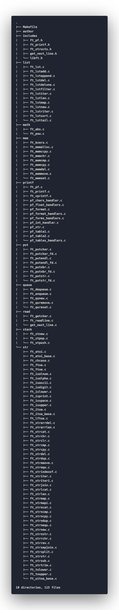

# LIBFT project

Libft - first project as a 42 students.

Libft - implementation of some of the [C Standard Library](https://en.wikipedia.org/wiki/C_standard_library) functions including some additional ones. It will be used in all subsequent C projects.

>*Note:* my Libft include some subsequent projects from Algorithm branch:
>- [get_next_line]()
>- [ft_printf]()

## Libft file structure

- **includes** - libft structures and function declarations, ft_printf, get_next_line headers
- **list** - functions for linked list manipulations
- **math** - simple math functions
- **mem** - functions for memory manipulations
- **printf** - my implementation of original printf (stdio.h)
- **put** - simple functions for manipulation with IO
- **queue** - queue implementation (on int32)
- **read** - functions for read from STDIN (get_next_line here)
- **stack** - stack implementation (on int32)
- **str** - functions for manipulation with null-terminated strings (include functions for converting types from string and into string)

## Future
This library will be supported in the future.
